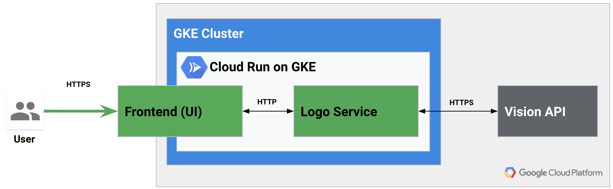
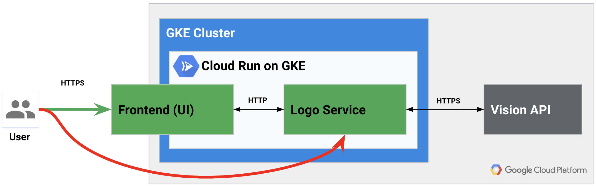

# HYB218 - Run a serverless platform anywhere with Kubernetes and Knative

> Make sure to [reset](#Reset) environment before demos

## Demo - Microservices (External/Internal Services)


In this demo we will show simple microservice using GCP Vision API

#### Logo Service

Deploy

```shell
gcloud beta run deploy klogo \
    --image=gcr.io/s9-demo/klogo@sha256:c91c08d92323d8d9e2b6c899249dde343ed61997db62d58deadb946b6365663d \
    --set-env-vars=RELEASE=v0.0.3,GCP_PROJECT_ID=s9-demo,GIN_MODE=release
```


Run image (https://storage.googleapis.com/kdemo-logos/google.png)

```shell
curl -H "Content-Type: application/json" \
     -d '{ "id": "logo1", "url": "https://storage.googleapis.com/kdemo-logos/google.png" }' \
     -X POST https://klogo.next.demome.tech/ | jq "."
```

#### Authentication App


* Demo UI (https://kdemo.next.demome.tech/)


#### Circumvent Auth



```shell
curl -H "Content-Type: application/json" \
     -d '{ "id": "logo2", "url": "https://storage.googleapis.com/kdemo-logos/google.png" }' \
     -X POST https://klogo.next.demome.tech/ | jq "."
```

#### Logo Service (Internal)

* Cloud Run (https://console.cloud.google.com/run/detail/cluster/us-west1-c/next/next/klogo/revisions?project=s9-demo)
  * Connectivity in Details to `Internal`

#### Direct Logo Service Access 404

```shell
curl -H "Content-Type: application/json" -v \
     -d '{ "id": "logo3", "url": "https://storage.googleapis.com/kdemo-logos/google.png" }' \
     -X POST https://klogo.next.demome.tech/
```

#### Overview

* Internal microservcies (Logo and User for metering)


## Reset

Reset the Cloud Run KLogo service to `External`

https://console.cloud.google.com/run/detail/cluster/us-west1-c/next/next/klogo/general?project=s9-demo

