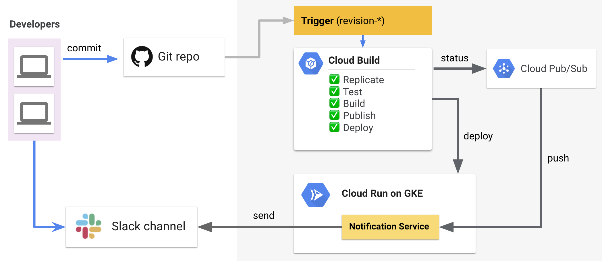

# SVR303 - Build Solutions With Serverless on Kubernetes Engine


## Demo 2 - Cloud Build Notification Events in Slack

In this demo we will create a push subscription to the build status queue in Cloud PubSub which will publish build status changes to a Cloud Run service which will publish these into Slack channel.

* Review notification service (https://github.com/mchmarny/pubsubnotifs)
  * Handler (receives Build status from PubSub push)
  * Sender (send builds Slack message from status and sends)
* Deploy it to Cloud Run (highlight conf, shared token)

```shell
gcloud beta run deploy pubsubnotifs \
    --image gcr.io/s9-demo/pubsubnotifs@sha256:d12b2403d0a3a7cdb401e5a7c2e98f66cd811d9dc18ef6d8bf5971831f4cb919 \
    --set-env-vars=NOTIFS_FOR_APP=maxprime,SLACK_API_TOKEN=$SLACK_API_TOKEN,SLACK_BUILD_STATUS_CHANNEL=$SLACK_BUILD_STATUS_CHANNEL,KNOWN_PUBLISHER_TOKENS=$KNOWN_PUBLISHER_TOKENS
```

* Create build status subscription in PubSub (global, simple, reliable MQ)

```shell
gcloud pubsub subscriptions create cloud-build-push-notif-demo \
    --topic=cloud-builds --ack-deadline=60 --message-retention-duration=1h \
    --push-endpoint=https://pubsubnotifs.next.demome.tech/push?token=$KNOWN_PUBLISHER_TOKENS
```

* Repeat release tagging process (https://github.com/mchmarny/maxprime)
* Slack to show `WORKING` notification
  * Use link to Cloud Build status
* Overview, builds on previous use-case

* Back to Slack to show `SUCCESS` notification

