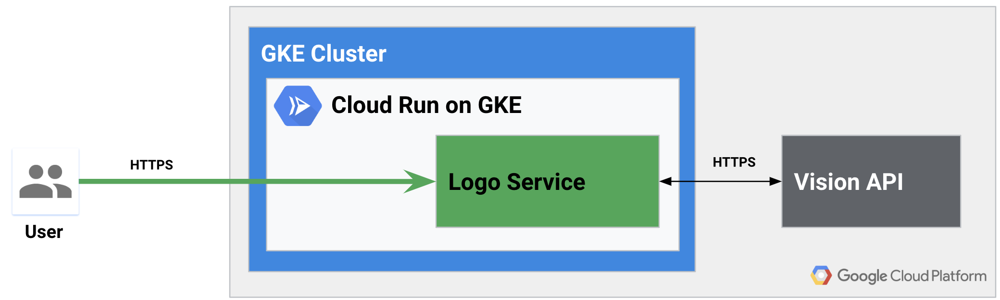
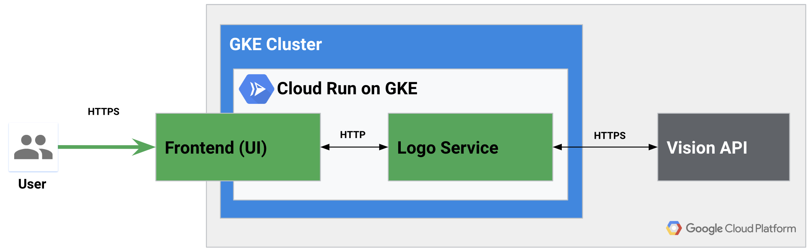
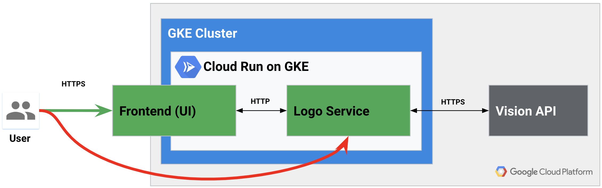
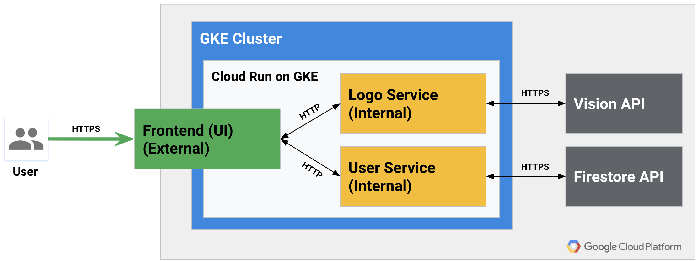

# Build Solutions With Serverless on Kubernetes Engine

> Note, this demo has some project specific dependencies. When possible I identified these in comments or defined them as environment variable to allow you to easily replace them. Still, in some cases like custom domain you will have to substitute `*.next.demome.tech` for your own domain. Please open an issue if you come across any other... issue.


## Demo 3 - Microservices (External/Internal Services)

In this demo we will show simple microservice using GCP Vision API. The longer version of this demo with source code links to the microservices used in this demo is covered in [HYB218](../HYB218/README.md).

### Logo Service



* Image (https://storage.googleapis.com/kdemo-logos/k8s.png)
* Image service ("Google" logo identified)

```shell
curl -H "Content-Type: application/json" \
     -d '{ "id": "logo1", "url": "https://storage.googleapis.com/kdemo-logos/k8s.png" }' \
     -X POST https://klogo.next.demome.tech/ | jq "."
```

### Authentication App


* Demo UI (https://kdemo.next.demome.tech/)


### Circumvent Auth



```shell
curl -H "Content-Type: application/json" \
     -d '{ "id": "logo2", "url": "https://storage.googleapis.com/kdemo-logos/k8s.png" }' \
     -X POST https://klogo.next.demome.tech/ | jq "."
```

### Logo Service (Internal)

* Cloud Run (https://console.cloud.google.com/run/detail/cluster/us-west1-c/next/next/klogo/revisions?project=s9-demo)
  * Connectivity in Details to `Internal`

### Direct Logo Service Access 404

```shell
curl -H "Content-Type: application/json" -v \
     -d '{ "id": "logo3", "url": "https://storage.googleapis.com/kdemo-logos/k8s.png" }' \
     -X POST https://klogo.next.demome.tech/
```

### Overview

* Internal microservices (Logo and User for metering)



