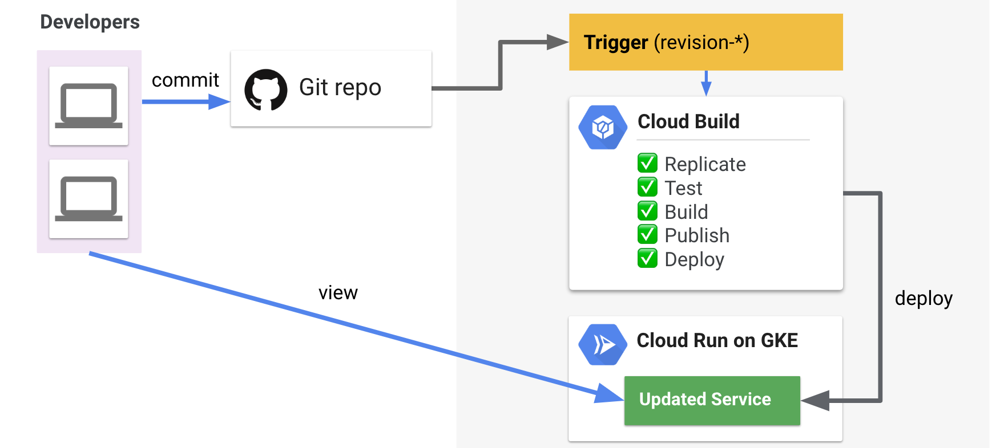

# SVR303 - Build Solutions With Serverless on Kubernetes Engine

> Make sure to [reset](#Reset) environment before demos

## Demos

### Demo 1 - Cloud Build Integration

Cloud Run takes images, in this demo we will show you how to create your service image and deploy it to Cloud Run using Cloud Build

* MaxpPime (http://maxprime.next.demome.tech/)
  * Highlight release number, follow link
  * Create new release (release-v0.0.*)
* Cloud Build in console (https://console.cloud.google.com/cloud-build/builds?project=s9-demo)
  * Detail on build, Show progress (don't watch, will take longer)
* Overview Cloud Build Integration

* Back to browser to show new release version 


### Demo 2 - Cloud Build Notification Events in Slack

In this demo we will create a push subscription to the build status queue in Cloud PubSub which will publish build status changes to a Clour Run service which will publish these into Slack channel. 

* Review notification service (https://github.com/mchmarny/pubsubnotifs)
  * Handler (receives Build status from PubSub push)
  * Sender (send builds Slack message from status and sends)
* Deploy it to Cloud Run (highlight conf, shared token)

```shell
gcloud beta run deploy pubsubnotifs \
    --image gcr.io/s9-demo/pubsubnotifs:latest \
    --set-env-vars=NOTIFS_FOR_APP=maxprime,SLACK_API_TOKEN=$SLACK_API_TOKEN,SLACK_BUILD_STATUS_CHANNEL=$SLACK_BUILD_STATUS_CHANNEL,KNOWN_PUBLISHER_TOKENS=$KNOWN_PUBLISHER_TOKENS
```

* Create build status subscription in PubSub (global, simple, reliable MQ)

```shell
gcloud pubsub subscriptions create cloud-build-push-notif-demo \
    --topic=cloud-builds --ack-deadline=60 --message-retention-duration=1h \
    --push-endpoint=https://pubsubnotifs.next.demome.tech/push?token=$KNOWN_PUBLISHER_TOKENS
```

* Repeat release tagging process (https://github.com/mchmarny/maxprime)
* Slack to show `WORKING` notification 
  * Use link to Cloud Build status 
* Overview, builds on previous use-case

* Back to Slack to show `SUCCESS` notification 


### Demo 3 - Microservices (External/Internal Services)

In this demo we will show simple microservice using GCP Vision API


#### Logog Service

* Image (https://storage.googleapis.com/kdemo-logos/google.png)
* Run image through service, and show "Google" logo identified

```shell
curl -H "Content-Type: application/json" \
     -d '{ "id": "logo1", "url": "https://storage.googleapis.com/kdemo-logos/google.png" }' \
     -X POST https://klogo.next.demome.tech/ | jq "."
```

#### UI App


* Demo UI (https://kdemo.next.demome.tech/)

#### Circumvent Auth


```shell
curl -H "Content-Type: application/json" \
     -d '{ "id": "logo2", "url": "https://storage.googleapis.com/kdemo-logos/google.png" }' \
     -X POST https://klogo.next.demome.tech/ | jq "."
```

#### Logog Service (Internal)

* Cloud Run (https://console.cloud.google.com/run/detail/cluster/us-west1-c/next/next/klogo/revisions?project=s9-demo)
  * Connectivity in Details to `Internal`

#### Direct Logog Service Access 404

```shell
curl -H "Content-Type: application/json" -v \
     -d '{ "id": "logo3", "url": "https://storage.googleapis.com/kdemo-logos/google.png" }' \
     -X POST https://klogo.next.demome.tech/
```

#### Overview

* Internal microservcies (Logo and User for metering)


## Reset

Run this before each demo to set know state

```shell
# Delete PubSub push subscription
gcloud pubsub subscriptions delete cloud-build-push-notif-demo

# Delete Notification Service in CR
gcloud beta run services delete pubsubnotifs

# Delete Knative Eventing Sources (subscriptions in PubSub, prevent dup notifications)
kubectl delete -f /go/src/github.com/mchmarny/knative-build-status-notifs/config/trigger.yaml -n demo
```

Also, reset the Cloud Run KLogo service to `External`

https://console.cloud.google.com/run/detail/cluster/us-west1-c/next/next/klogo/general?project=s9-demo

