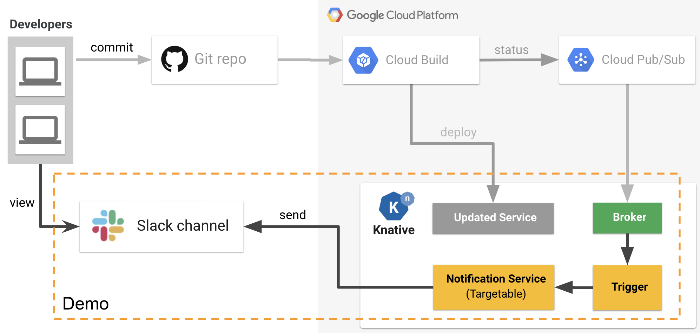
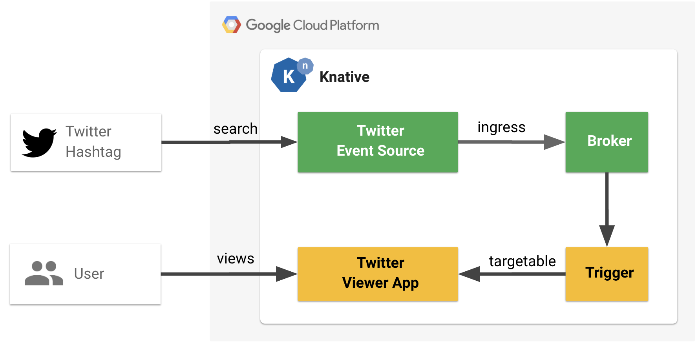

# SVR305 - Generating Events from Your Internal Systems with Knative

> Make sure to [reset](#Reset) environment before demos


## Demo 1 - Cloud Build status event triggering Knative service

### Setup

```shell
cd /go/src/github.com/mchmarny/knative-build-status-notifs
code .
```



### Notification service

Source code (https://github.com/mchmarny/knative-build-status-notifs):
* **Handler** - extracts Cloud Build notification from received Cloud Event
* **Sender** - creates message from Cloud Build notification and sends it to Slack

> The `build-notif` expects `POST`, still you can check if it is installed by goign to https://build-notif.demo.knative.tech/ (`Invalid request` expected)

### Trigger

Apply following YAML (`config/trigger.yaml`)

```yaml
apiVersion: eventing.knative.dev/v1alpha1
kind: Trigger
metadata:
  name: slacker-build-status-notifier
spec:
  subscriber:
    ref:
      apiVersion: serving.knative.dev/v1alpha1
      kind: Service
      name: build-notif
```

Using `kubectl`

```shell
kubectl apply -f config/trigger.yaml -n demo
```

Should return

```shell
trigger.eventing.knative.dev/slacker-build-status-notifier created
```

Verify that `slacker-build-status-notifier` trigger was created

```shell
kubectl get triggers -n demo
```

Should return

```shell
NAME                           READY     REASON    BROKER    SUBSCRIBER_URI                               AGE
slacker-build-status-notifier  True                default   http://build-notif.demo.svc.cluster.local/   37s
```

### Execute

* Create a release tag (e.g. release-v0.0.*) in GitHub (https://github.com/mchmarny/maxprime)
* Check Cloud Build for build status (https://console.cloud.google.com/cloud-build/builds?project=s9-demo)
* View notification in Slack (#build-status)


## Demo 2 - How to install Twitter event source and wire it to Knative service

```shell
cd /go/src/github.com/mchmarny/twitter
code .
```



### UI

Open https://tevents.demo.knative.tech (should be empty if soure/trigger were cleaned up)


### Source

Apply following YAML (`config/source.yaml`)

> `--query=KnativeDemo` is where you can define the Twitter search term (hashtag or simple string). Secrets have already been configured.


```yaml
apiVersion: sources.eventing.knative.dev/v1alpha1
kind: ContainerSource
metadata:
  name: twitter-source
spec:
  args:
  - --query=KnativeDemo
  env:
  - name: TWITTER_CONSUMER_KEY
    valueFrom:
      secretKeyRef:
        key: consumer-key
        name: twitter-secret
  - name: TWITTER_CONSUMER_SECRET_KEY
    valueFrom:
      secretKeyRef:
        key: consumer-secret-key
        name: twitter-secret
  - name: TWITTER_ACCESS_TOKEN
    valueFrom:
      secretKeyRef:
        key: access-token
        name: twitter-secret
  - name: TWITTER_ACCESS_SECRET
    valueFrom:
      secretKeyRef:
        key: access-secret
        name: twitter-secret
  image: us.gcr.io/probable-summer-223122/source-7dd4982354a958712ad81ca4a42243dd@sha256:9bfa60a5d6edaedd5431d751595b54b1282a3f4e7b512a6bb6784e8be4699a5c
  sink:
    apiVersion: eventing.knative.dev/v1alpha1
    kind: Broker
    name: default

```

Using `kubectl`

```shell
kubectl apply -f config/source.yaml -n demo
```

Should return

```shell
containersource.sources.eventing.knative.dev/twitter-source created
```

Verify that `twitter-source` source was created

```shell
kubectl get sources -n demo
```

Should return

```shell
NAME             AGE
twitter-source   1d
```

### Trigger

Applying following YAML (`config/trigger.yaml`)

> Notice the `type: com.twitter` filter

```yaml
apiVersion: eventing.knative.dev/v1alpha1
kind: Trigger
metadata:
  name: twitter-events-viewer
spec:
  filter:
    sourceAndType:
      type: com.twitter
  subscriber:
    ref:
      apiVersion: serving.knative.dev/v1alpha1
      kind: Service
      name: tevents
```

Using `kubectl`

```shell
kubectl apply -f config/trigger.yaml -n demo
```

Should return

```shell
trigger.eventing.knative.dev/twitter-events-viewer created
```

Verity that `twitter-events-viewer` trigger was created

```shell
kubectl get triggers -n demo
```

Should return

```shell
NAME                    READY   REASON    BROKER    SUBSCRIBER_URI                               AGE
twitter-events-viewer   True              default   http://build-notif.demo.svc.cluster.local/   37s
```

### Execute

* View UI again (https://tevents.demo.knative.tech)
* Ask audience to tweet something with the term defined in the source's `--query=KnativeDemo` argument


## Reset

Run this before each demo to set know state

```shell
# Delete PubSub push subscription (prevent dup notifications in Slack)
gcloud pubsub subscriptions delete cloud-build-push-notif-demo

# Demo 1
kubectl delete -f /go/src/github.com/mchmarny/knative-build-status-notifs/config/trigger.yaml -n demo

# Demo 2
kubectl delete -f /go/src/github.com/mchmarny/twitter/config/source.yaml -n demo
kubectl delete -f /go/src/github.com/mchmarny/twitter/config/trigger.yaml -n demo
```

Make sure the `build-notif-*` is already installed

```shell
kubectl get kservice -n demo | grep build-notif
```

Should return

```shell
build-notif   build-notif.demo.knative.tech   build-notif-j7nk5   build-notif-j7nk5   True
```

